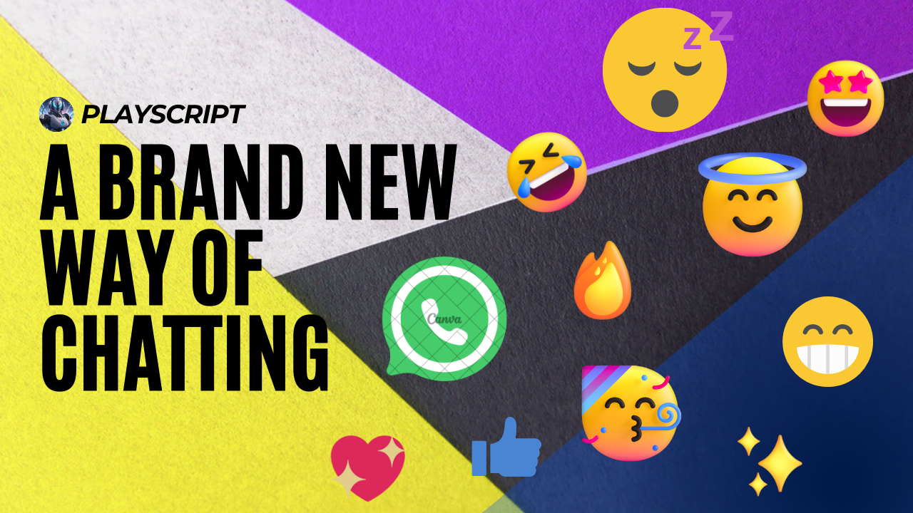

  <h1>Emojilator - From Me to You</h1>

  <a href="https://youtube.com/@playscript"></a>

  ## Overview

The Emoji Translator is a fun React-based web application that allows users to translate text into emojis effortlessly. 

Whether you prefer typing or speaking, this app caters to your needs!

  ## Key Features
  1.**Text Translation**: Translate your text into a delightful array of emojis using re-usable components and a predefined emoji map.
  
  2.**Voice Recognition**: Activate voice recognition with a simple button click, and watch your spoken words instantly transform into emojis.
  
  3.**Suggestions**: Receive word suggestions as you type, making it even easier to express yourself with emojis.
  
  4.**Copy Translations**: Copy your translated text with a single click and paste it anywhere.

  5.**Styling**: Make your long texts into a beautiful sticker with our Styling Text Output Maker.

  6.**Map**: With our map, Explore the traditions and cultures used in each countries of the World.
  
  ## How to Use

  <a href="https://youtube.com/@playscript"></a>
  
  
  **Step 1:** Enter your text in the provided textarea.
  
  **Step 2:** Get word suggestions for a quick emoji conversion.
  
  **Step 3:** Click the "Translate" button to convert your text into emojis.
  
  **Step 4:** Use the "Start Voice" button to translate your spoken words into emojis.
  
  **Step 5:** Copy the translated text with the "Copy" button for sharing.

  ## Installation
  Clone the repository: git clone https://github.com/playscrbot/Emojilator.git

  #### Install Dependencies 

  ```bash
  npm install "@nextui-org/react@^2.2.9" \
    "downloadjs@^1.4.7" \
    "html-to-image@^1.11.11" \
    "leaflet@^1.9.4" \
    "nodemon@^3.0.2" \
    "react-burger-menu@^3.0.9" \
    "react-leaflet@^4.2.1" \
    "react-router-dom@^6.21.1" \
    "react-spinners@^0.13.8"
  ```
  
  #### Run the app 

  ```bash
  npm run dev
  ```
  
  ## Contribution
  Contributions are welcome! Feel free to open issues or pull requests to improve the app.
  
  ## License
  This project is licensed under the MIT License - see the LICENSE file for details.


  
  Have fun translating your messages into emojis! 😄🚀
